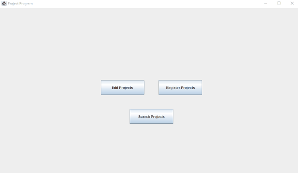

<!--- How to add gif from: https://josephcardillo.medium.com/how-to-add-gifs-to-your-github-readme-89c74da2ce47 --->

# An overview

## A description of how it works
This program is related to architectural projects, and keeps track of the relevant parties involved, which is the customer, contractor, and architect. Other information is also kept, such as the invoice and information about the project itself.

The primary information about the project itself includes:
1. Project name
2. The building type
3. The physical address
4. ERF number
5. Deadline and completion dates
6. The relevant parties (architect, customer, contractor)

## The purpose
This program was created as part of the HyperionDev course, and thus its purpose is purely for practicing/demonstrating existing programming skills. I do not see any practical uses of this program in its current state.

## Who will benefit?
Anybody that is fairly new to Java and interested in the basics of the MVC design pattern.

# Installation
Feel free to contact me via email to setup a call so that I can do a screen-share of the program.

If however, you prefer to do the setup on your own, below are the necessary steps.

There are quite a few steps that you will need to do on your end in order to run this program:
1. Java: Head over to Oracle's website in order to download the software (https://www.oracle.com/za/java/technologies/javase-downloads.html)
2. Java Development Kit:(https://www.oracle.com/za/java/technologies/javase/javase-jdk8-downloads.html).
3. An IDE (such as eclipse): https://www.eclipse.org/downloads/
4. MySQL: https://dev.mysql.com/downloads/mysql/
5. Create a database called "poisepms". Create a user called otheruser, with a password of java_proj.
6. Run the create_tables.txt file (creates a list of tables used in the program).
7. Link the JDBC connector JAR file within Eclipse.

You should now be able to run the "GUIProgram.java" file, as it contains the java main method.

# Improvements
Aspects of the program that can be improved upon:
1. While this program adds a GUI, making it much more user-friendly, it can still be improved upon, such as in terms of its colors and fonts.
2. A loyal customer base can be implemented, where customers get discounts for future projects.
3. The Swing library can be changed to use the newer JavaFX library for its GUI components.

# Licensing
There is no formal licensing for this program, however any distribution, modification and it being packaged to be sold is NOT permissible. Permission will be given by myself for you to download and use the program on your computer, however please remove it once you are done with it.

# Contact information
If you have any further questions, feel free to reach out to me at:
- Email: kylejulies8@gmail.com

# References for the program
There are many references used for this program. See the references.txt file.

